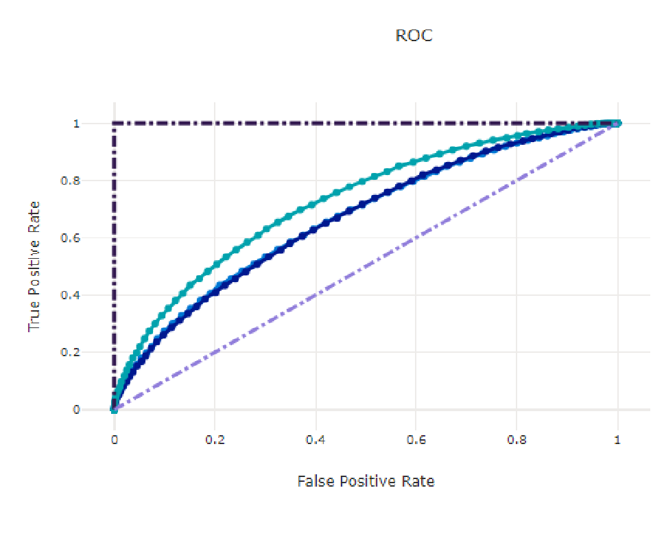
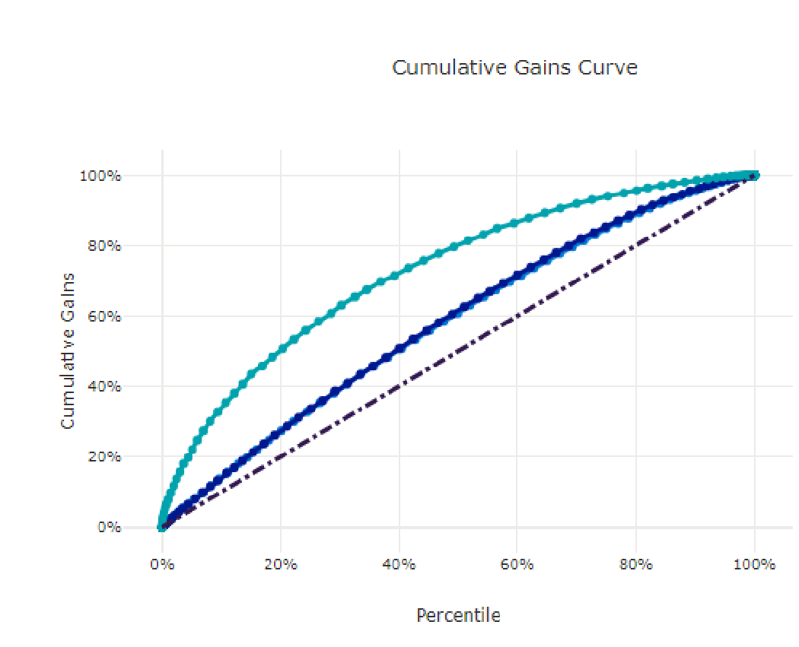

## Readmission Use Case

Using Azure Data and AI services to build, deploy and operationalize a model to predict hospital readmissions.

## Readmission Use Case Details

* **Source**: 10K Diabetes data set from https://www.kaggle.com/mathchi/diabetes-data-set
* **Use Case Details**: The use case combines clinical and demographic for diabetes patients that were admitted to the hospital. 
* **Target Variable**: Readmitted which indicates whether a patient was readmitted back to the hospital within 30 days of discharge.
* **Size**: 10k records with 25 fields containing numerical, categorical and text features.

## Readmission Use Case Data

* **Target Variable**: Readmitted: True/False was the patient readmitted.
* **Candidate Predictor Variables include**:
	- Numerical: *Number_diagnoses*, *Time_in_hospital*, *Numer_of_medications*
	- Categorical: *Gender*, *Race*, *Primary_diagnosis*, *Payer*
	- Text: *Diagnosis_Description*

## Architecture

## Key Architectural Decisions

* **Azure Machine Learning**: Contains wide tool set to prepare data then build models with flexibility for varying skill sets and tool preferences. Scales well with different organizations.
* **Managed Endpoints**: Low overhead method for deploying ML models using either real time endpoints or batch endpoints.
* **Azure Data Factory**: Robust tool for moving data into data lake storage.
* **Synapse Analytics**: Offers Synapse Workspace which allows engineers to create transformation pipelines in either Spark or TSQL.
* **Synapse SQL Pools**: High performance SQL engine that connects well other tools to materialize results (such as Power BI).

## Detailed Architecture

## Results

* **Algorithm Chosen:** Voting Ensemble with different flavors of boosted tree models.
	- Performed best when evaluating out-of-sample (OOS) AUC.
	- Inference time generally not as important as performance/accuracy on these types of use cases.
* **Results:** OOS AUC: 0.73 and OOS Balanced Accuracy: 0.61

## Takeaways

* **Model Performance:** Readmission predictions and similar use cases are often great POC use cases because models tend to perform well and lead to great value (especially at scale).
* **Why Azure?:** Azure has all of the needed resources to quickly and accurately go from data to model to deployment. Moreover, Azure tools are available to fit different personas for folks who are building models (business analyst to data scientist).
* **Tips and Lessons Learned:**
	- Understand success criteria up front. Is it model performance? is it time to produce models? is it cost?
	- You do not need DBs of data; most models can be built on tens of thousands records depending on the variable set.
	- If model performance matters understand benchmarks ahead of time.
	- AutoML is your friend! That feature can allow any users to build a highly accurate model quickly. Always push for text data as a predictor as a way to increase model performance.

## Demo Video

## Helpful Links

[Azure Machine Learning]("https://docs.microsoft.com/en-us/azure/machine-learning/")

[Azure Synapse]("https://docs.microsoft.com/en-us/azure/synapse-analytics/")

[Azure AutoML]("https://docs.microsoft.com/en-us/azure/machine-learning/concept-automated-ml")

[Azure Managed Endpoints]("https://docs.microsoft.com/en-us/azure/machine-learning/how-to-deploy-managed-online-endpoints")

